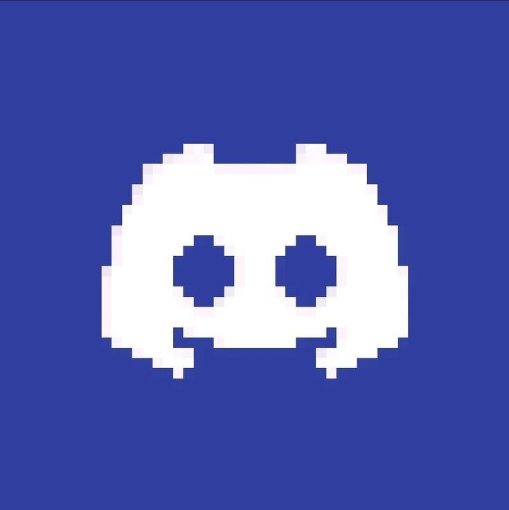
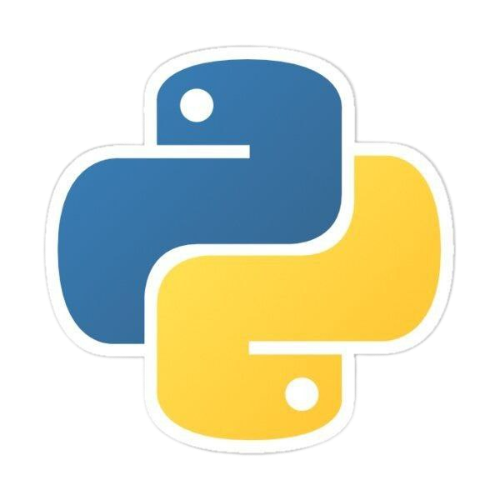
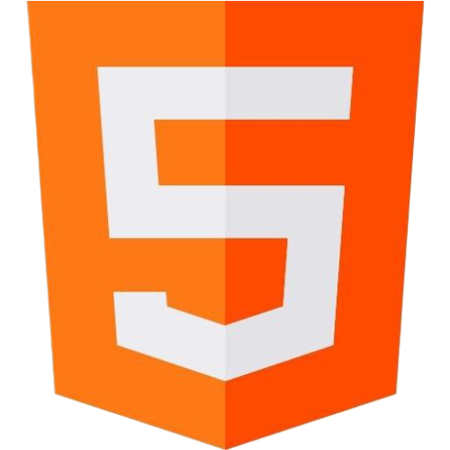
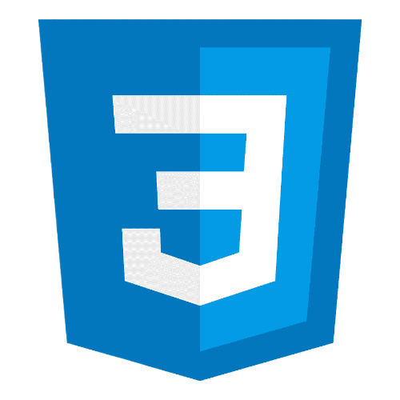
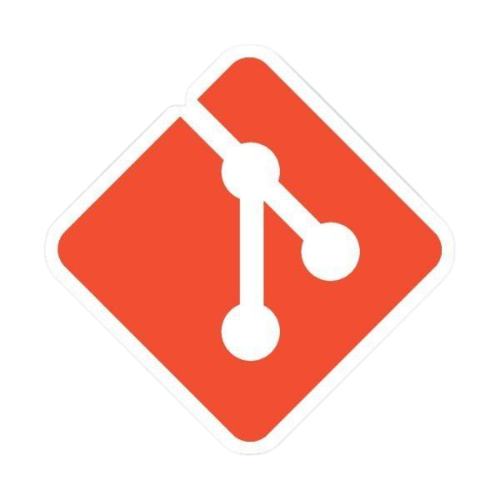
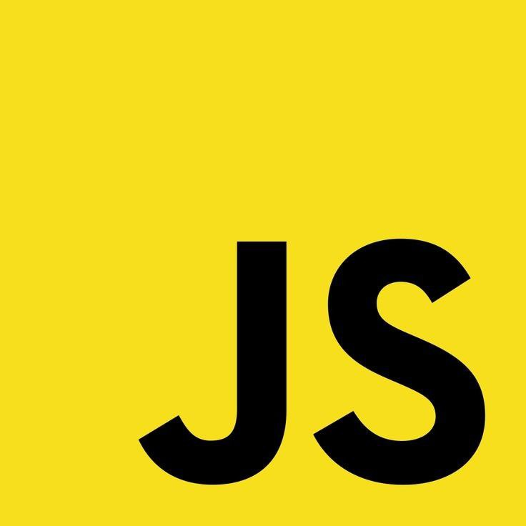
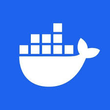

# About Me

    

        
😃Hello, my name is Parsa

        
<strong>📚Computer Science Student</strong>

        
💻I am a novice programmer in the field of Backend.

        
🤖I am also interested in Discord bots and enjoy developing a Discord bot.
 
        

            <a href="https://discord.gg/yE8tQchmju" style="display: flex; align-items: center;">
                
                
Here is our Discord Channel

            </a>
        

    

---

# Skills

    
        
    
    
    

---

# Start To Learn

    
    

---

# Activity

